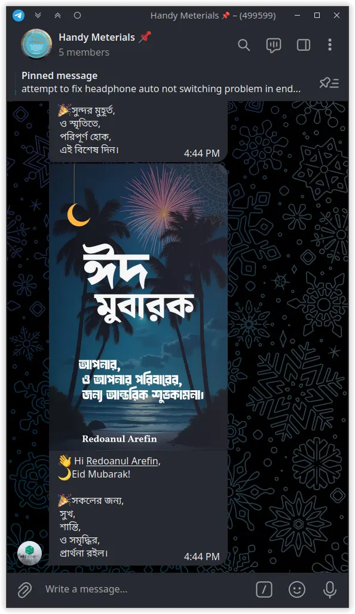

# 🌙 Telegram Eid Greetings Card Bot 🎉

Welcome to the **Telegram Eid Greetings Card Bot**! This bot is designed to spread joy and blessings during Eid by generating personalized greeting cards and messages for your Telegram group members. 🎨✨

## 🚀 Features

- **Personalized Eid Cards**: Automatically generate beautiful Eid Mubarak cards for each group member.
- **Randomized Greetings**: Choose from a variety of heartfelt greetings in Bengali.
- **Easy to Use**: Simple commands to generate and share cards in your Telegram groups.
- **Open Source**: Contribute and improve the project on [GitHub](https://github.com/SharafatKarim/telegram-eid-greetings-card-bot).

## 🖼️ Example Output

Here’s an example of a generated Eid card:

| Screenshot from Telegram | Sample card 1 | Sample card 2 |
|---------------------------|----------------|----------------|
|  |  |  |

## 🛠️ Installation

1. **Clone the Repository**:

   ```bash
   git clone https://github.com/SharafatKarim/telegram-eid-greetings-card-bot.git
   cd telegram-eid-greetings-card-bot
   ```

2. **Create and Activate a Virtual Environment**:

   ```bash
   python -m venv .venv
   source .venv/bin/activate  # On Windows: .venv\Scripts\activate
   ```

3. **Install Dependencies**:

   ```bash
   pip install -r requirements.txt
   ```

4. **Set Up Environment Variables**:
   - Create a `.env` file in the root directory.
   - Add the following variables:

     ```properties
     API_ID=your_api_id
     API_HASH="your_api_hash"
     SESSION_STRING="your_session_string"
     TELEGRAM_BOT_TOKEN="your_bot_token"
     ```

   > You can take a look into `.env.sample` file for reference.

5. **Run the Bot**:

   ```bash
   python bot.py
   ```

## 📋 Usage

### Basic

Make sure you have the appropriate permission to watch the group members list
(if you are using your own `API_ID`, `API_HASH` and `SESSION_STRING`).
And the bot should be added to the group with proper permissions
to tag members and send messages.

- **`/start`**: Get a welcome message and instructions.
- **`/help`**: View detailed help information.
- **`/gen`**: Generate personalized Eid cards for all group members (group-only command).

## 📂 Project Structure

```
telegram-eid-greetings-card-bot/
├── assets/                # Fonts and other assets
├── templates/             # Card templates
├── output/                # Generated cards
├── bot.py                 # Main bot logic (for Telegram bot)
├── lib.py                 # Helper functions for Telegram API
├── main.py                # Image generation logic (for standalone use)
├── config.json            # Configuration for greetings and templates
├── .env                   # Environment variables
└── readme.md              # Project documentation
```

> [!important]
> If you just want to generate Eid cards, you can ignore the `bot.py` and `lib.py` files.
> Simply run the `main.py` script to generate cards using the default template and greetings.

## 🤝 Contributing

We welcome contributions! To contribute:

1. Fork the repository.
2. Create a new branch for your feature or bug fix.
3. Submit a pull request with a detailed description of your changes.

## 📜 License

- This project is licensed under the [CC0 License](https://creativecommons.org/publicdomain/zero/1.0/).
- And the templates are modified version of [Eid Card Generator - Codepotro](https://github.com/codepotro/Eid-Card-Generator/) project.
If your'e a designer feel free to use your own or create a PR to improve the project.

## 🌟 Acknowledgments

- **[Python Telegram Bot](https://python-telegram-bot.readthedocs.io/)**: For simplifying Telegram bot development.
- **[Telethon](https://docs.telethon.dev/)**: For advanced Telegram API interactions.
- **[Pillow](https://pillow.readthedocs.io/)**: For image processing.

And I was inspired by an [Eid Card Generator - Codepotro](https://github.com/codepotro/Eid-Card-Generator/).
Special thanks go to this kool project. My default asset (**AbuSayed-Regular** font) and the basic concept
of default template is taken from their repository.

## 📬 Contact

For questions or feedback, feel free to reach out:

- **GitHub**: [SharafatKarim](https://github.com/SharafatKarim)
- **Telegram**: [@SharafatKarim](https://t.me/SharafatKarim)
- **Email**: <sharafat@duck.com>

Let’s make this Eid special together! 🌙✨
